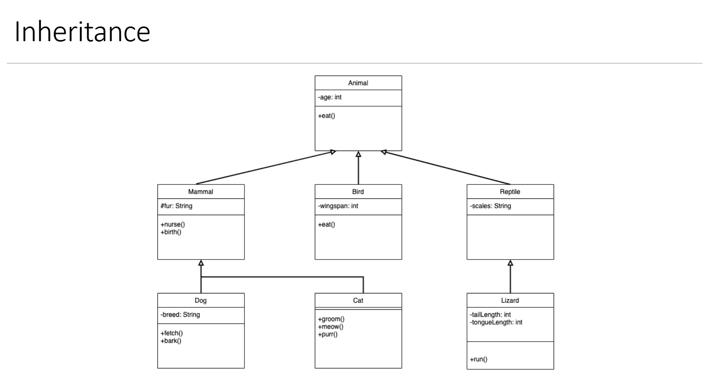
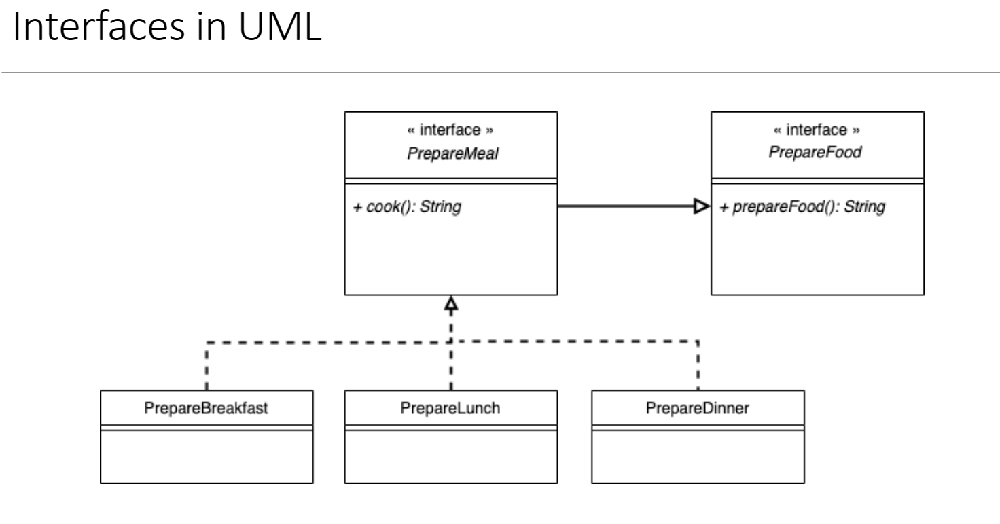
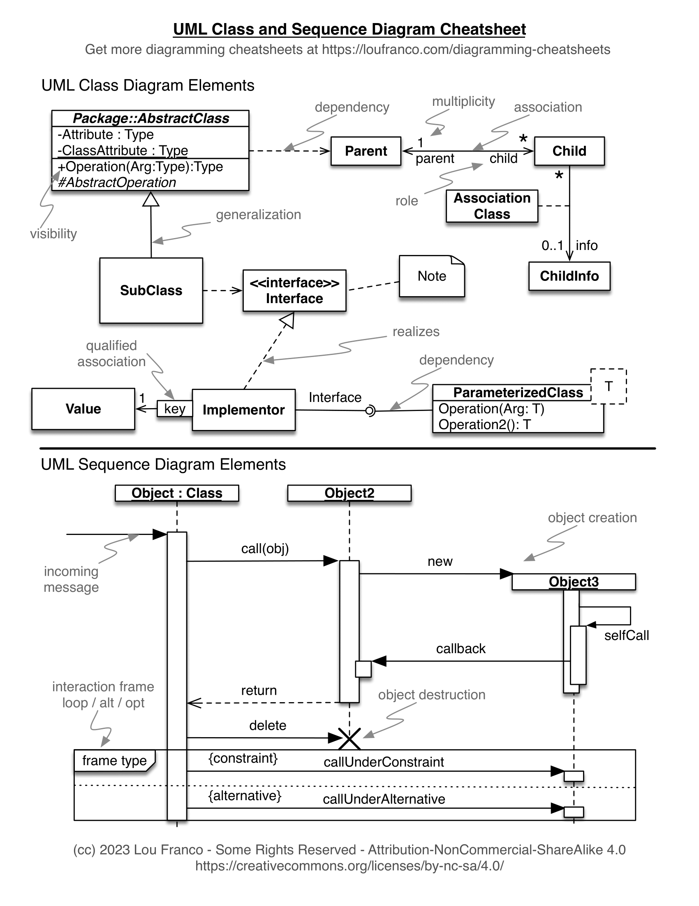

# Brainstorm

## Individual Assignment 1

Before we begin, take a look at the rubric

> * Are all important concepts represented with classes?
> * Are all classes, methods, and variables appropriately named?
> * Do all classes, methods, and variables have appropriate access and are final and static
> used appropriately?
> * Does the UML diagram align with all mandatory requirements?
> * Are UML standards adhered to and is the diagram clear?
> * Are principles of encapsulation and abstraction adhered to?
> * Does the design demonstrate an understanding of inheritance, polymorphism, interfaces
>  and data structures?

Goal for the week: Complete the UML Diagram

Advisable to start from the UML Diagram they provide. They say that
its incomplete, but I think it's pretty good (save for the family
relationship).

Also **required** to use 'Inheritance' and 'Interface'. Just to
remind you, here's how to represent both these concepts in a UML
diagram.

As show, we can use a line with a hollow arrow head
to demonstrate both inheritance and interfaces. It's
a **solid line** for Inheritance, but a **dashed line** for Interfaces.
In both concepts, you don't need to show inherited / interfaced methods
in the child classes, it follows that the must be implemented.

Furthermore, here is the UML cheat sheet provided for you in the D2L shell,

### Tips / Ideas

* Here's my theory on **interfaces** and **abstract classes**. 
Abstract classes represent concrete objects like Animal, Person - stuff
that you can see touch and feel concretely. Interface represents
an **animating spirit**. It deals with what the object should
do, how it should act e.g. predator, prey, provider etc.

### How to Improve the Family Relationship
What about a `Family` class?\
This class would have mother, father, sibling attribute e.t.c.

The above cannot work. We are relating a `Person` object to 
another `Person` object. It must be a reflexive relationship.

Since this topic is icky, I googled it. This is what I found

### Helper Functions
* A `dateParser` function that takes in a date format and returns the
required format
* An `ageCalculator` that takes in the birthdate and returns the age.
* 

### Big Database
Heredi

### Let's talk about Interface, Inheritance and Abstract Class

 What about interfaces regarding getters, setters and constructors?

* Both Inquirer and DisasterVictim are 'Person' objects
and so will extend / inherit the Person class. 
  * The Person class will have common methods
  and can also extend the interface discussed 
  above.
  * To kiss my own ass. A family member can be a Person but not 
  necessarily a DisasterVictim, so it's necessary to have
  Person as a class (not an interface) so that it can be
  instantiated for other objects.

* Shelter should extend location.
  * Think about it, not everyone is in a shelter, and it is 
  important to distinguish between those people currently in
  shelters and those in other locations around the world.

* ReliefService should extend `EmergencyReliefServices` **abstract class**
  * This interface will have some methods like 
    * `getUrgentVictim` from the PriorityQueue
    * ...
  * Of course the victim will need to have some identifying
  features to know if they're urgent. I suggest a class that
  extends `DisasterVictim` called `MissingPerson`. These
  guys have gone missing and might be dead. Their whereabouts
  are unknown.

### Let's talk about Enums

* **All gender options** from the 'GenderOptions.txt' will be 
considered enums.
* It is required to use Enums for dietary restriction (ref - 10
from requirements)

### Requirements

1. Use `ArrayLists<>` instead of `Arrays[]` for all iterables
because we need them to be growable. In ReliefService, multiple
people can be missing. Consequently, we should be able to 
use a **priority queue to manage who needs the most attention.**
2. For Family relationships, I'm thinking of a 'Family' class
3. 

